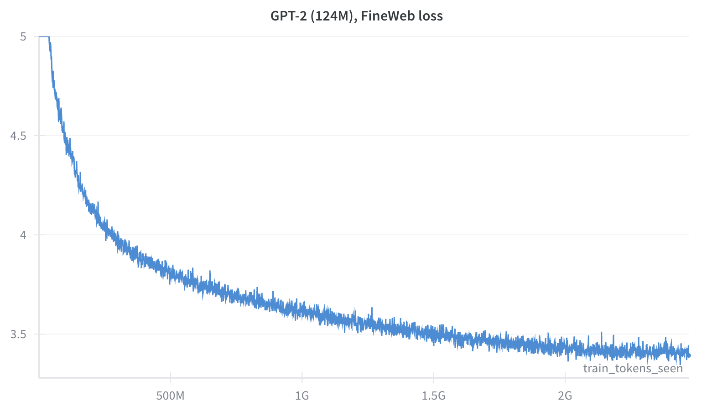

# Picodo: fast pretraining in pure JAX

- only ~360 SLOC
- implements a transformer decoder in pure JAX (no Flax / NNX)
- achieves 39% MFU on TPU v6e-1 when training GPT-2 (124M)
- supports FSDP (Fully Sharded Data Parallel) training
- can run on GPUs, TPUs, Google Colab, or even locally on a Mac

# Training

[](https://colab.research.google.com/github/martin-marek/picodo/blob/main/train_colab.ipynb)

Picodo requires a pretokenized dataset for training following the same format as [nanoGPT](https://github.com/karpathy/nanoGPT/tree/master/data/openwebtext). This speeds up training (especially for small models) and simplifies the codebase. FineWeb / FineWeb-Edu can be downloaded in this format using:
```bash
python download_fineweb.py fineweb 10
```

To train a model using bash, override values directly from the CLI:
```bash
python train.py data.path=~/datasets/fineweb_gpt2.bin model.D=768 model.L=12 model.T=1024 model.V=50257 opt.batch_size=8
```

You can also use this codebase through the provided [Colab notebook](https://colab.research.google.com/github/martin-marek/picodo/blob/main/train_colab.ipynb), which automatically installs requirements, downloads the dataset, and starts training a model.


